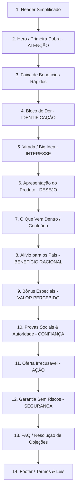

# 2. PRD & Arquitetura da Informação

Este documento reúne o **Product Requirements Document (PRD)** e a **Arquitetura da Informação** para o desenvolvimento e o design da landing page do **Mãos na Palavra™**.

---

## Part 1: Product Requirements Document (PRD)

### 1. Visão Geral do Projeto
* **Nome do Projeto:** Landing Page de Vendas Mãos na Palavra™
* **Objetivo de Negócio:** Maximizar a taxa de conversão (CVR) de visitantes frios e mornos em compradores do infoproduto digital "Mãos na Palavra™" pelo valor promocional de R$ 37,00.
* **Público-Alvo:** Mães e pais cristãos (foco em mães de 25 a 45 anos) com filhos de 3 a 8 anos.
* **Problema a Resolver:** A culpa materna gerada pelo excesso de tempo que as crianças passam em telas (celulares, tablets, TVs) e a falta de uma alternativa cristã prática, rápida, barata e envolvente para substituir esses momentos.

### 2. Escopo do Projeto

#### Em Escopo
* Desenvolvimento de uma Landing Page responsiva (Mobile-First de alta fidelidade).
* Integração com plataforma de pagamentos (Hotmart, Kiwify ou Eduzz).
* Implementação de rastreamento avançado (Google Analytics 4, Meta Pixel e Google Tag Manager).
* Direção de arte infantil cristã premium com assets otimizados para web.
* Otimização de performance extrema (mínimo de 90 pontos no PageSpeed Insights para mobile).
* Acessibilidade digital em conformidade com as diretrizes WCAG 2.1 AA.

#### Fora de Escopo
* Desenvolvimento de sistema próprio de área de membros (será usada a infraestrutura da plataforma de checkout escolhida).
* Automação de e-mail marketing pós-venda (será tratada na plataforma de pagamento/e-mail marketing externa).
* Envio de produto físico (o material é 100% digital).

### 3. Requisitos Funcionais

| ID | Requisito | Descrição |
| :--- | :--- | :--- |
| **RF-01** | **Responsividade Dinâmica** | A página deve se adaptar perfeitamente a telas de dispositivos móveis, tablets e computadores, priorizando a legibilidade e facilidade de clique no mobile. |
| **RF-02** | **Player de Áudio Demonstrativo** | Um mini player de áudio personalizado na seção de bônus para que a mãe possa ouvir uma prévia das histórias bíblicas em áudio antes de comprar. |
| **RF-03** | **Accordion de FAQ** | Seção de perguntas frequentes interativa, onde o usuário clica na pergunta para expandir a resposta de forma suave, sem recarregar a página. |
| **RF-04** | **Botão de CTA Inteligente** | Os botões de CTA devem direcionar diretamente para o link do checkout externo com parâmetros de rastreamento (ex: `src=lp_hero`, `src=lp_oferta`). |
| **RF-05** | **Sticky CTA Mobile** | Um botão flutuante persistente no rodapé em dispositivos móveis, que surge após a primeira dobra e facilita a compra a qualquer momento da rolagem. |
| **RF-06** | **Carrossel de Provas Sociais** | Slider interativo de depoimentos em formato de prints do WhatsApp e fotos de crianças utilizando o produto, otimizado para toque em telas mobile. |

### 4. Requisitos Não Funcionais

| ID | Requisito | Métrica/Especificação |
| :--- | :--- | :--- |
| **RNF-01** | **Performance (Speed)** | Nota no Google PageSpeed Insights >= 90 para Mobile. LCP (Largest Contentful Paint) < 2.5s. |
| **RNF-02** | **Acessibilidade** | Conformidade WCAG 2.1 nível AA. Contraste mínimo de texto de 4.5:1. Suporte a leitores de tela com tags semânticas e atributos `aria-*`. |
| **RNF-03** | **Segurança e Privacidade** | Selo de compra segura no checkout. Conformidade com a LGPD (Aviso de Cookies simplificado e link para Política de Privacidade e Termos de Uso no Footer). |
| **RNF-04** | **Disponibilidade** | Hospedagem em CDN de alta performance (ex: Vercel, Netlify ou Cloudflare) para suportar picos de tráfego de lançamentos e tráfego pago. |

### 5. Métricas de Sucesso (KPIs)
* **Taxa de Conversão da LP (CVR):** Meta de 3.5% a 5% em tráfego qualificado (Meta Ads focado em mães).
* **Tempo Médio na Página:** > 1 minuto e 30 segundos (indica leitura da copy).
* **Taxa de Rejeição (Bounce Rate):** < 45%.
* **Clique no Checkout (CTR de Saída):** Meta de 15% a 20% dos visitantes clicando em algum botão de compra.

### 6. Eventos de Conversão (Rastreamento)
* `page_view` (Visualização da página)
* `view_item` (Visualização da oferta principal ao rolar até a seção de preço)
* `click_cta` (Cliques em qualquer botão de compra com parâmetro identificador do botão)
* `faq_expand` (Interação com o FAQ, indicando dúvidas do usuário)
* `audio_play` (Clique para ouvir a prévia das histórias em áudio)
* `scroll_depth` (Disparos em 25%, 50%, 75% e 90% da página)

---

## Part 2: Arquitetura da Informação da LP

A ordem das seções foi estrategicamente planejada utilizando o modelo clássico AIDA (Atenção, Interesse, Desejo, Ação) adaptado para a psicologia de pais cristãos.

### Detalhamento das Seções

#### 1. Header Simplificado
* **Objetivo Psicológico:** Estabelecer a marca com leveza, sem distrações (sem menu de navegação).
* **Conteúdo:** Logotipo "Mãos na Palavra™", selo sutil de "Material 100% Digital".
* **Visual:** Logo centralizado ou alinhado à esquerda. Cores suaves.
* **CTA:** Nenhum.
* **Objeção Resolvida:** *"O site é seguro?"* (Visual profissional e limpo).
* **Emoção:** Profissionalismo, acolhimento.
* **Prioridade Mobile:** Alta (tamanho reduzido para não ocupar espaço vertical valioso).

#### 2. Hero / Primeira Dobra
* **Objetivo Psicológico:** Capturar a atenção imediata através de uma promessa forte, emocional e visualmente rica.
* **Conteúdo:** Headline de impacto, subtítulo esclarecedor, mockup 3D realista do produto digital e foto/ilustração de criança colorindo de forma calma, 5 selos rápidos de benefício.
* **Visual:** Fundo em tom pastel caloroso. Criança colorindo alegremente com luz natural. Mockup do livro aberto revelando as páginas bíblicas. Elementos lúdicos flutuantes (estrelinhas, nuvens suaves).
* **CTA:** Botão de destaque: **"Quero o Mãos na Palavra™"** com microcopy ("Acesso imediato por R$ 37").
* **Objeção Resolvida:** *"Sobre o que é esse site?"* / *"Para quem é isso?"*
* **Emoção:** Esperança, alívio, encanto.
* **Prioridade Mobile:** Máxima. Deve encaixar a headline, os selos e o botão acima da dobra (ou visível com rolagem mínima).

#### 3. Faixa de Benefícios Rápidos
* **Objetivo Psicológico:** Mostrar valor imediato de forma gráfica e de rápida leitura.
* **Conteúdo:** Título "Em vez de mais tela, seu filho recebe:" seguido por 6 cards ilustrados (Cor, Calma, Fé, Criatividade, Histórias Bíblicas, Atividades Longe do Celular).
* **Visual:** Faixa horizontal com fundo contrastante suave. Ícones lúdicos desenhados à mão.
* **CTA:** Nenhum.
* **Objeção Resolvida:** *"O que meu filho ganha trocando o celular por isso?"*
* **Emoção:** Curiosidade, desejo de desenvolvimento saudável.
* **Prioridade Mobile:** Alta. Exibir em formato de grid 2x3 ou slider horizontal para não alongar a página.

#### 4. Bloco de Dor
* **Objetivo Psicológico:** Gerar identificação profunda através da empatia (espelho da rotina da mãe), sem gerar culpa destrutiva.
* **Conteúdo:** Título "Você reconhece essa situação?", texto curto empático sobre a exaustão da rotina e 5 bullets com situações comuns (crises ao tirar a tela, imitação de falas de vídeos, etc.). Fechamento acolhedor tirando o peso da culpa.
* **Visual:** Cores ligeiramente mais neutras/calmas (tons de azul acinzentado suave). Personagem da ovelhinha com expressão pensativa/triste ao lado do texto.
* **CTA:** Nenhum.
* **Objeção Resolvida:** *"Ninguém entende como a minha rotina é difícil."*
* **Emoção:** Validação, acolhimento, alívio de não estar sozinha.
* **Prioridade Mobile:** Média. Texto compacto e escaneável.

#### 5. Virada / Big Idea (O Pivot)
* **Objetivo Psicológico:** Mudar a perspectiva da mãe sobre como resolver o problema (não é só proibir a tela, é substituir por algo melhor).
* **Conteúdo:** Título "Criança não fica com as mãos vazias por muito tempo." Texto conceitual forte sobre a necessidade de dar algo tátil e focado em Jesus para ocupar o espaço deixado pela tela.
* **Visual:** Transição visual para cores ensolaradas e alegres (amarelo suave, verde infantil). Ilustração conceitual: uma mão infantil soltando um tablet cinza e pegando um lápis de cor vibrante com uma Bíblia e desenhos ao fundo.
* **CTA:** Nenhum.
* **Objeção Resolvida:** *"Eu já tentei tirar o celular e não funcionou."*
* **Emoção:** Revelação ("Aha!"), clareza mental.
* **Prioridade Mobile:** Alta. Deve ser uma leitura rápida e marcante.

#### 6. Apresentação do Produto
* **Objetivo Psicológico:** Apresentar a solução definitiva para a Big Idea exposta.
* **Conteúdo:** Título "Apresentamos o Mãos na Palavra™", explicação da autoria (mãe e educadora Carol), mockup grande e detalhado do livro aberto mostrando o conteúdo interno de alta qualidade.
* **Visual:** Destaque para o mockup do produto digital. Ilustrações dos mascotes (Mila e Ben) comemorando e pintando.
* **CTA:** Botão de compra.
* **Objeção Resolvida:** *"O que é esse produto exatamente?"*
* **Emoção:** Segurança, desejo de posse, credibilidade.
* **Prioridade Mobile:** Alta. Mockup centralizado ocupando boa parte da tela.

#### 7. O Que Vem Dentro (Features)
* **Objetivo Psicológico:** Detalhar a riqueza do material para justificar o valor e criar sensação de fartura.
* **Conteúdo:** Lista detalhada dos temas e tipos de atividades (desenhos bíblicos, histórias, atividades de calma, temas de Noé, Davi, Jesus).
* **Visual:** Cards coloridos e organizados com imagens reais das páginas internas do PDF.
* **CTA:** Nenhum.
* **Objeção Resolvida:** *"Vou receber apenas desenhos soltos ou tem conteúdo de verdade?"*
* **Emoção:** Entusiasmo, percepção de alto valor.
* **Prioridade Mobile:** Média. Cards empilhados ou carrossel horizontal.

#### 8. Benefícios para os Pais (Alívio)
* **Objetivo Psicológico:** Vender o benefício para quem paga (a mãe), focando na praticidade e no ganho de tempo na rotina.
* **Conteúdo:** Título "Feito para crianças. Mas pensado para aliviar a rotina dos pais." Bullets focados em poupar tempo (sem busca no Google, sem brigas para tirar a tela, sem necessidade de inventar brincadeiras).
* **Visual:** Layout limpo. Ilustração da mãe descansando ou trabalhando tranquila enquanto a criança pinta ao fundo.
* **CTA:** Nenhum.
* **Objeção Resolvida:** *"Isso vai me dar mais trabalho ou vai facilitar minha vida?"*
* **Emoção:** Alívio, desejo de tempo livre produtivo.
* **Prioridade Mobile:** Média.

#### 9. Bônus Especiais
* **Objetivo Psicológico:** Aumentar drasticamente o valor percebido e quebrar as objeções de "meu filho não gosta de pintar" ou "preciso de mais atividades".
* **Conteúdo:** Apresentação dos 3 bônus (1. Plataforma de Histórias em Áudio com mini player; 2. Kit de Dobraduras Cristãs; 3. Guia Cantinho Cristão Sem Telas).
* **Visual:** Cards premium com visual de "presente/bônus", selo de "R$ 0,00" ou "Grátis". Player de áudio interativo real na seção do Bônus 1.
* **CTA:** Nenhum.
* **Objeção Resolvida:** *"E se meu filho enjoar de colorir?"* / *"Como faço para criar o hábito?"*
* **Emoção:** Surpresa positiva, ganância bem-intencionada (ganhar muito por pouco).
* **Prioridade Mobile:** Alta. Cada bônus deve ser apresentado com clareza.

#### 10. Provas Sociais & Autoridade
* **Objetivo Psicológico:** Validar socialmente a decisão de compra. Eliminar a desconfiança de fraude na internet.
* **Conteúdo:** Fotos de crianças reais usando as folhas impressas, depoimentos em texto/WhatsApp de mães agradecidas, mini-biografia da Carol (professora de jardim de infância e mãe cristã).
* **Visual:** Grid de imagens reais e prints de depoimentos com estrelas de avaliação (5 estrelas). Foto calorosa e amigável da Carol com seus filhos.
* **CTA:** Nenhum.
* **Objeção Resolvida:** *"Será que funciona mesmo?"* / *"Quem criou isso é confiável?"*
* **Emoção:** Confiança, validação social, conexão humana.
* **Prioridade Mobile:** Alta. Slider horizontal fácil de navegar.

#### 11. Oferta Irrecusável
* **Objetivo Psicológico:** Facilitar a ação de compra imediata eliminando a barreira do preço.
* **Conteúdo:** Recapitulação de tudo o que o cliente leva (Livro + 3 Bônus), ancoragem de preço (De R$ 137 por R$ 37), opções de parcelamento (5x de R$ 10,52) e selos de segurança de pagamento.
* **Visual:** Box de oferta destacado com borda colorida suave, fundo contrastante, temporizador sutil de "tempo limitado" (opcional), botões de checkout grandes e coloridos.
* **CTA:** **"Quero tirar meu filho das telas com Jesus"** (Microcopy: "Acesso imediato por apenas R$ 37,00").
* **Objeção Resolvida:** *"Está caro."* / *"Posso comprar depois."*
* **Emoção:** Urgência leve, certeza de excelente negócio.
* **Prioridade Mobile:** Máxima. Deve ser extremamente limpo, com o preço em tamanho grande e o botão ocupando toda a largura da tela.

#### 12. Garantia Sem Riscos
* **Objetivo Psicológico:** Transferir todo o risco da transação do comprador para o vendedor.
* **Conteúdo:** Selo de garantia de 7 dias (ou prazo legal), texto explicando que se ela imprimir e o filho não gostar, o dinheiro é devolvido sem perguntas.
* **Visual:** Ícone/Selo de Garantia ilustrado com estilo infantil (um escudo amigável ou medalha com ramo de oliveira).
* **CTA:** Nenhum.
* **Objeção Resolvida:** *"E se eu comprar e meu filho não gostar?"*
* **Emoção:** Segurança absoluta, tranquilidade.
* **Prioridade Mobile:** Alta. Texto curto e selo legível.

#### 13. FAQ (Perguntas Frequentes)
* **Objetivo Psicológico:** Sanar as últimas dúvidas racionais que impedem o clique final no checkout.
* **Conteúdo:** 15 perguntas e respostas detalhadas sobre formato (digital), entrega (e-mail), uso na igreja, impressora, etc.
* **Visual:** Accordion interativo e limpo.
* **CTA:** Botão final de checkout abaixo do FAQ para capturar o usuário que tirou suas dúvidas.
* **Objeção Resolvida:** Várias objeções técnicas e práticas menores.
* **Emoção:** Clareza, certeza.
* **Prioridade Mobile:** Alta. Accordion economiza espaço vertical crucial.

#### 14. Footer (Rodapé)
* **Objetivo Psicológico:** Cumprir normas legais, passar seriedade corporativa e dar suporte.
* **Conteúdo:** Direitos autorais, CNPJ, link para Políticas de Privacidade, Termos de Uso, e-mail de suporte.
* **Visual:** Fundo em tom pastel escuro ou neutro, fontes pequenas e legíveis.
* **CTA:** Nenhum.
* **Objeção Resolvida:** *"Essa empresa é real?"*
* **Emoção:** Segurança institucional.
* **Prioridade Mobile:** Baixa.
